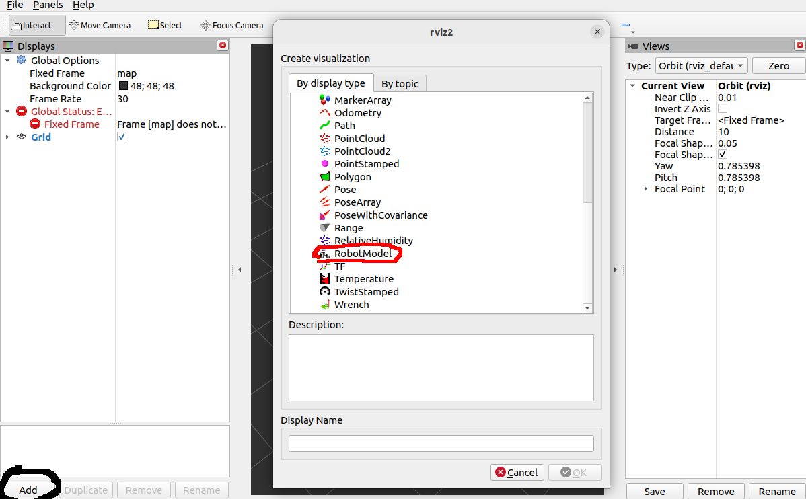
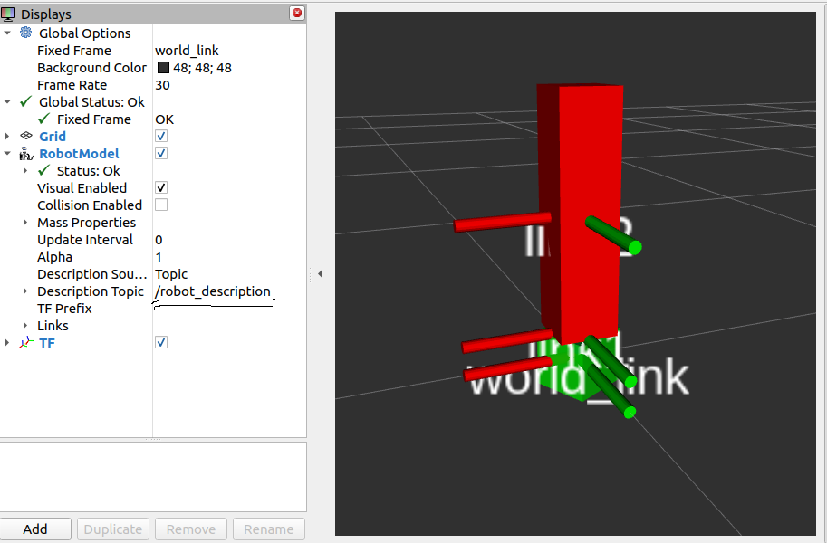
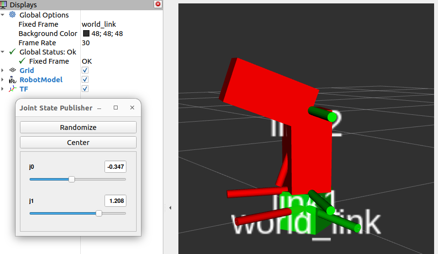
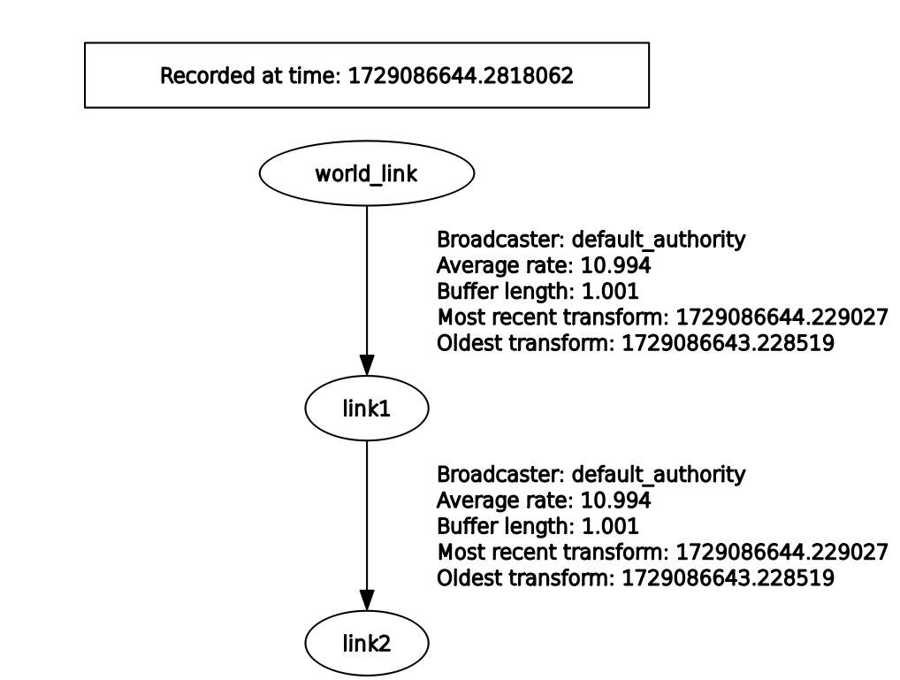
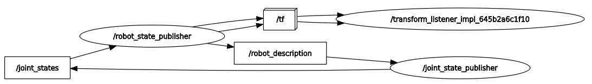

# ROS 2 SIMULATION 16/10/2024

## USAGE
Add within your cmake:
```
install(
  DIRECTORY launch urdf
  DESTINATION share/${PROJECT_NAME}
)
```

In order to make the launch file visible to your ROS system.

Build the package with
```
colcon build --packages-select links_urdf
```

Launch robot-state-publisher, joint-state-publisher and rviz2 with:
```
ros2 launch links_urdf links.launch.py
```


if you haven't saved any configuration as .rviz file, in order to see your model inside rviz you have to add the RoborModel plugin


Then you must change the fixed frame to one of the available options for your robot. Finally, select /robot_description in the Description topic window and your roboot should appear




If you have launched the joint-state-publisher-gui, a slider bar will appear to move the joints. 
If you haven't installed it yet, launch in your terminal
```
sudo apt-get install ros-<distro>joint-state-publisher-gui
```
If you are running this command inside a container, and haven't updated the package manager yet, type
```
sudo apt-get upgrade
```
```
sudo apt-get update
```
Joint-state-publisher-gui will make appear a sliding window by which you can change the configuration of the robot. 



Is possible to read the joints configuration from the /joint_states topic
```
ros2 topic echo /joint_states
```

Remember that you can use the following commands to display all the nodes and topic
```
ros2 topic list
```
```
ros2 node list
```

In another terminal, open rqt. You can check the TF tree published by the robot_state_publisher.



and the ros2 computational graph:



From there, you can see how the robot_state_publisher is publishing both the transformations and the robot_description


Spawn the robot in Gazebo using the *create* node:
```
ros2 launch links_urdf links_gazebo.launch.py
```

# Exercise

* Download the iiwa_description package from [iiwa repository](https://github.com/ICube-Robotics/iiwa_ros2/tree/main)
* Create a launch file to spawn the Iiwa in Gazebo (you just need to change the paths inside the launch file provided in this repo) 
* Check if the robot spawns both in Gazebo and Rviz


